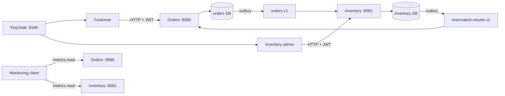

# Order Reservation System

A Java 25 and Spring Boot 4 portfolio project demonstrating contract-first APIs,
service-owned PostgreSQL databases, asynchronous Kafka workflows, transactional
outboxes, idempotent consumers, OAuth2 resource servers, and observability.

An order starts as `PENDING`. Orders publishes `OrderCreated`; Inventory reserves
every line in one transaction and publishes `StockReserved` or `StockRejected`;
Orders then moves the order to `CONFIRMED` or `REJECTED`.



## Modules and ownership

| Module | Responsibility |
| --- | --- |
| `api-contracts` | Source OpenAPI documents and generated Spring server interfaces |
| `api-clients` | Java clients generated from the same OpenAPI documents |
| `event-contracts` | Versioned Kafka event records and strict JSON codec |
| `dlt-replay-tool` | Raw-byte, single-record manual DLT recovery utility |
| `order-service` | Owned orders, API idempotency, order outbox, result consumer |
| `inventory-service` | Owned products/stock, atomic reservations, result outbox |

Orders and Inventory use different database users and schemas. Each service runs
only the Flyway scripts in its own `src/main/resources/db/migration/` directory.
Neither service reads the other database or calls the other HTTP API for business
flow.

The stack uses Java 25, Spring Boot 4.1, Maven, Spring Kafka, Spring Data JPA,
PostgreSQL 17, Kafka 4 in KRaft mode, Keycloak 26, Flyway, OpenAPI Generator,
springdoc, Actuator, Micrometer, Prometheus exposition, and Testcontainers. Images
and build dependencies are pinned in `compose.yaml` and the Maven parent.

## Start the complete stack

You need Docker with the Compose plugin. Host Java and Maven are unnecessary for
running the application. Copy the local-only credentials once:

```bash
cp .env.example .env
docker compose up --build --wait
```

The example passwords and client secrets are deliberately weak and suitable only
for an isolated workstation. `.env` is ignored by Git.

| Component | Local address | Access |
| --- | --- | --- |
| Orders API / Swagger | `http://localhost:8080` | `CUSTOMER`, `orders-api` audience |
| Inventory API / Swagger | `http://localhost:8081` | customer read or admin write |
| Orders management | `http://localhost:9080` | health public; metrics protected |
| Inventory management | `http://localhost:9081` | health public; metrics protected |
| Keycloak | `http://localhost:8180` | Reservation realm |

PostgreSQL and Kafka have no host ports. Kafka is available only inside the Compose
network.

Stop containers while retaining databases and Kafka records:

```bash
docker compose down
```

Delete containers **and all named-volume data** for a clean reset:

```bash
docker compose down --volumes
```

## Reproducible demo

The demo requires `curl`, `jq`, a healthy Compose stack, and `.env`. It gets three
short-lived client-credentials tokens: Orders customer, Inventory administrator,
and a separate monitoring token. Tokens remain in process memory, are passed to
curl through standard input, and are never printed or written to a file.

```bash
./scripts/demo.sh
```

Every run creates a new product and new idempotency keys, so it works against
retained volumes. The script:

1. creates an empty product and adds 10 units;
2. places an order for 3 and waits at most 45 seconds for `CONFIRMED`;
3. places an order for 8 and requires `REJECTED / INSUFFICIENT_STOCK`;
4. proves the failed all-or-nothing reservation left exactly 7 units; and
5. authenticates to both Prometheus endpoints and checks business metrics.

Override URLs or `POLL_TIMEOUT_SECONDS` through environment variables when needed.
Every HTTP request has connection and total timeouts. Any non-2xx response,
unexpected state, malformed body, or polling timeout fails the run.

## HTTP contracts and examples

The versioned source contracts are
[`orders.yaml`](api-contracts/src/main/resources/openapi/orders.yaml) and
[`inventory.yaml`](api-contracts/src/main/resources/openapi/inventory.yaml). The
running services expose the unchanged files at `/openapi/orders.yaml` and
`/openapi/inventory.yaml`. Swagger UIs are at:

- `http://localhost:8080/swagger-ui.html`
- `http://localhost:8081/swagger-ui.html`

Example payloads (use a suitable short-lived bearer token in `$TOKEN`):

```bash
curl --fail-with-body \
  -H "Authorization: Bearer $TOKEN" \
  -H 'Content-Type: application/json' \
  -d '{"name":"Keyboard","initialQuantity":5}' \
  http://localhost:8081/products

curl --fail-with-body \
  -H "Authorization: Bearer $TOKEN" \
  -H 'Content-Type: application/json' \
  -H 'Idempotency-Key: checkout-2026-001' \
  -d '{"items":[{"productId":"PRODUCT_UUID","quantity":2}]}' \
  http://localhost:8080/orders
```

Do not paste real tokens into scripts, shell history, logs, or issue reports. The
demo script shows a safer stdin-based curl configuration.

### Generated clients

`api-clients` generates separate Java clients during Maven's `generate-sources`
phase. Generated files stay below `target/` and are never committed. A consumer in
this reactor can attach a caller-owned access token through the request interceptor:

```java
var apiClient = new io.github.tmejs.reservation.client.orders.ApiClient()
        .setScheme("http").setHost("localhost").setPort(8080)
        .setRequestInterceptor(request ->
                request.header("Authorization", "Bearer " + accessToken));
var orders = new io.github.tmejs.reservation.client.orders.api.OrdersApi(apiClient);
var item = new io.github.tmejs.reservation.client.orders.model.OrderItem()
        .productId(productId).quantity(2);
var request = new io.github.tmejs.reservation.client.orders.model.CreateOrderRequest()
        .items(java.util.List.of(item));
var order = orders.createOrder("checkout-2026-001", request);
```

The application never embeds a token in generated code.

## Security model

Business APIs are stateless OAuth2 resource servers. They validate signature,
issuer, time claims, and the service-specific audience. Realm roles authorize
operations:

| Principal | Role | Allowed behavior |
| --- | --- | --- |
| Alice / Bob | `CUSTOMER` | Create and read only their own orders; read products |
| Inventory admin | `INVENTORY_ADMIN` | Create products, add stock, read products |
| Monitoring account | `metrics.read` scope | Scrape metrics; no business role |

Order ownership comes only from JWT `sub`. Another customer's order returns 404 to
avoid identifier enumeration. Idempotency keys are scoped by subject, so Alice and
Bob can safely use the same text key.

For human login, open either Swagger UI, select **Authorize**, and use Alice
(`alice` / `alice-demo-password`), Bob (`bob` / `bob-demo-password`), or inventory
admin (`admin` / `admin-demo-password`) as appropriate. The public
`reservation-swagger` client uses Authorization Code with mandatory PKCE S256,
exact localhost redirects, and no browser secret. Direct password grants are
disabled. Scripts use narrower service accounts configured in `.env`.

Local HTTP, development-mode Keycloak, and demo credentials are local-only choices.
Broker TLS/authentication and production secret management are version-two work.

## Event contracts

Kafka keys are order UUID strings. Values are JSON records from `event-contracts`:

```json
{
  "metadata": {
    "eventId": "UUID",
    "eventType": "OrderCreated",
    "schemaVersion": 1,
    "occurredAt": "2026-09-28T12:00:00Z",
    "orderId": "UUID"
  },
  "items": [{"productId": "UUID", "quantity": 2}]
}
```

`StockReserved` has the same metadata plus `causationId`, the original
`OrderCreated.eventId`. `StockRejected` adds a bounded `reason`:
`UNKNOWN_PRODUCT` or `INSUFFICIENT_STOCK`. The codec rejects malformed JSON,
incorrect event types, and schema versions other than 1. IDs belong in payloads and
structured logs, never metric labels.

| Topic | Producer | Consumer | DLT |
| --- | --- | --- | --- |
| `orders.v1` | Orders outbox | Inventory | `orders.v1.DLT` |
| `reservation-results.v1` | Inventory outbox | Orders | `reservation-results.v1.DLT` |

## Reliability guarantees and limits

- Domain state and its outgoing event commit in one PostgreSQL transaction. An
  acknowledged Kafka send is marked published afterward.
- Outbox failures remain pending with bounded exponential retry. A crash after send
  but before marking can publish the same event again.
- Consumers claim event IDs transactionally. Duplicate delivery has one business
  effect; repeated order IDs cannot reserve stock twice.
- Inventory locks product rows in deterministic order and reserves all lines or
  none. Concurrent orders cannot oversell.
- Consumer failures receive the original attempt plus three one-second retries.
  Then the exact key/value is synchronously written to the matching `.DLT`; if DLT
  publication fails, the source offset is not committed.
- Order creation is idempotent per owner and key. A key reused with changed content
  returns 409. Stock addition itself is intentionally not idempotent.

This local topology has one broker, one partition per topic, and one instance of
each service. Ordering is per partition; blocking retries pause that partition.
There is no cross-system distributed transaction, automatic DLT replay, or global
exactly-once claim. Idempotency gives effectively-once business effects for modeled
events. Prometheus counters are operational telemetry, not an accounting ledger,
and reset with the process.

## Metrics and logs

Health endpoints are public and intentionally terse:

```bash
curl --fail http://localhost:9080/actuator/health/readiness
curl --fail http://localhost:9081/actuator/health/readiness
```

`/actuator/prometheus` requires a monitoring token with both service audiences and
`metrics.read`. The demo performs authenticated scrapes. Metrics include HTTP,
JVM, HikariCP and Kafka observations, created orders, reservation outcomes and
duration, duplicate events, DLT results, and periodically refreshed outbox gauges.
Labels use bounded event types, outcomes, and reason codes.

Logs use ECS JSON and include `orderId` / `eventId` correlation where available.
They never log bearer tokens or Authorization headers. Prometheus, Grafana,
dashboards, and alert rules are planned for version two.

## Inspect and replay one dead-letter record

Fix the underlying cause before replay. Inspect offsets and record metadata without
showing payloads. Kafka has no host port, so commands use a one-shot tools container:

```bash
docker compose run --rm --no-deps -T \
  --entrypoint /opt/kafka/bin/kafka-get-offsets.sh kafka-init \
  --bootstrap-server kafka:9092 --topic orders.v1.DLT

docker compose run --rm --no-deps -T \
  --entrypoint /opt/kafka/bin/kafka-console-consumer.sh kafka-init \
  --bootstrap-server kafka:9092 --topic orders.v1.DLT \
  --partition 0 --offset earliest --timeout-ms 10000 \
  --property print.partition=true --property print.offset=true \
  --property print.key=true --property print.value=false
```

Choose one exact partition and offset. The tool derives the source only through its
two hard-coded allowlisted mappings, then run:

```bash
./scripts/replay-dlt.sh orders.v1.DLT 0 12
```

The containerized helper directly assigns the requested DLT partition, seeks the
exact offset, validates the original-topic and original-partition headers, and sends
exactly one new source record. It uses byte-array deserializers/serializers, so null,
empty, newline, and NUL-containing keys and values are never routed through shell
variables, text delimiters, JSON parsing, or payload files. It waits for broker
acknowledgement, never commits a DLT consumer offset, never removes the source DLT
record, and never displays or edits its body or IDs. Afterward, verify the
order/product state and ensure the record did not return to the DLT. Replaying twice
is safe for supported events because consumer idempotency prevents a second business
effect, though duplicate telemetry can increase.

## Local verification

Select Java 25 and keep Docker running:

```bash
./mvnw -B verify
docker compose config --quiet
```

The seven-module reactor runs unit tests and Failsafe integration tests with real
PostgreSQL, Kafka, and Keycloak. Coverage includes migrations, generated clients,
JWT and ownership, HTTP and consumer idempotency, atomic/concurrent reservations,
outbox recovery, redelivery, DLT handling, health, metrics, and correlation data.

## Troubleshooting

- **Missing Compose variable:** copy `.env.example` to `.env`; Compose refuses to
  invent secrets.
- **Service never becomes healthy:** run `docker compose ps` and
  `docker compose logs --tail=200 order-service inventory-service keycloak kafka`.
  Readiness depends on PostgreSQL and Kafka; liveness does not.
- **Token rejected:** confirm the `reservation` issuer, expiry, service audience,
  and required realm role or `metrics.read`. Host tokens use issuer
  `http://localhost:8180/realms/reservation`.
- **Port busy:** stop the conflicting process or use a Compose override.
- **Surprising retained data:** the demo is repeatable; use the destructive reset
  above only when a truly empty environment is required.
- **Message in a DLT:** inspect logs and the exact DLT offset, repair the cause,
  replay one selected record, and verify domain state.

## Development record

[`codex/`](codex/) contains the approved design, decisions, checkpoint briefs,
independent reviews, and local verification evidence produced with Codex. Deferred
ideas are tracked in [`codex/version-2.md`](codex/version-2.md).
